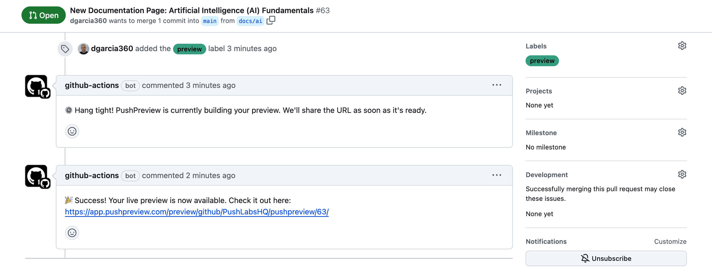

To ensure proper functioning of the PushPreview integration in your GitHub repository, follow these steps:

1. Create a new pull request in your GitHub repository.
1. Add the `preview` label to your new pull request.
1. Wait briefly for PushPreview to process the pull request and post a comment in the pull request thread.
1. Look for a comment from PushPreview containing a preview link. Click this link to view the changes.

Congratulations on setting up PushPreview! Your users can now view live previews of changes in pull requests, enhancing collaboration and review efficiency.